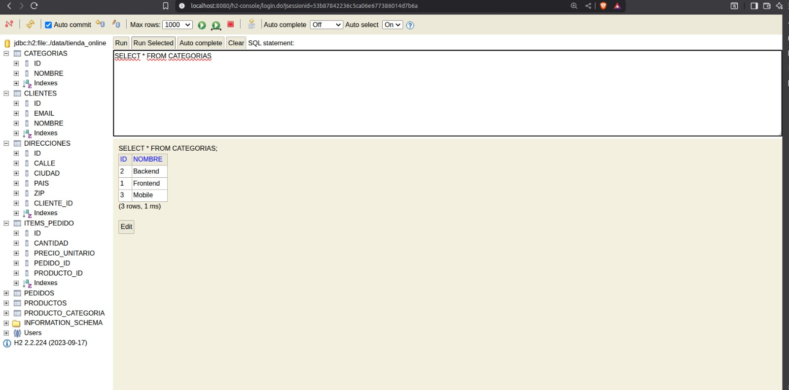
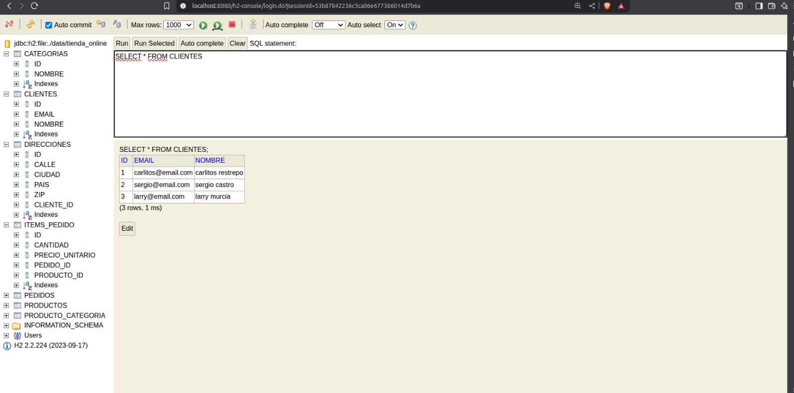
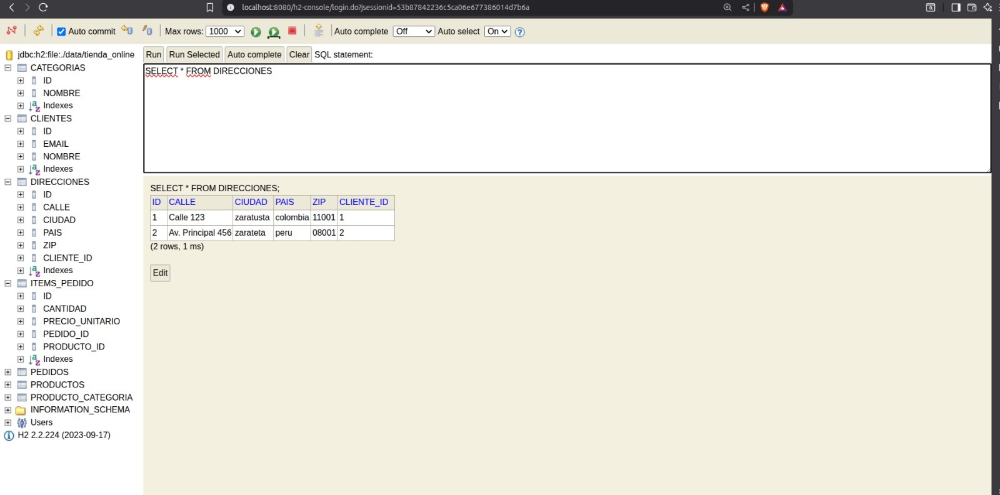
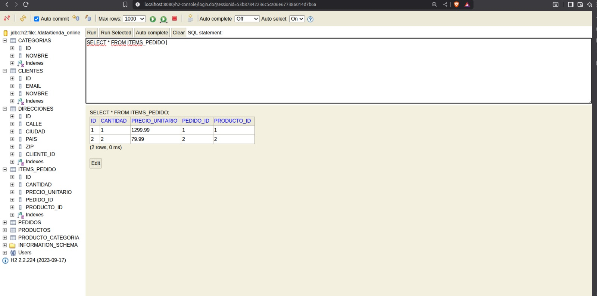
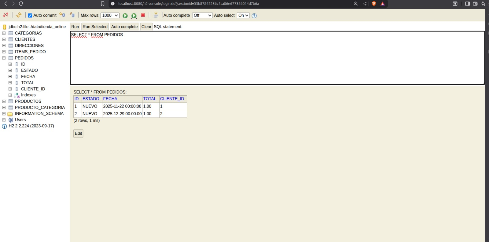
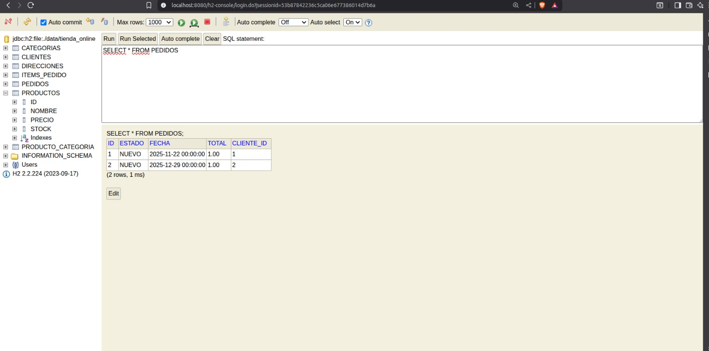

propietario: Larry Jan Pierr Murcia Lozano

PARA COMPILAR Y EJECUTAR EL PROYECTO
mvn clean compile
mvn compile spring-boot:run

BASE DE DATOS H2 archivo en ./data/tienda_online

API REST: http://localhost:8080/api
H2 Console: http://localhost:8080/h2-console
URL: jdbc:h2:file:./data/tienda_online
Usuario: sa
Contraseña: (vacía)

CREAR CATEGORÍAS

Las categorías agrupan productos y tienen una relación N:M con ellos.

Crear producto con categorías:

nombre: Laptop Gaming
precio: 1299.99
stock: 10

Luego asignar categorías:

categorias: Gaming, Computadoras, Electrónicos

CREAR CLIENTES

Los clientes tienen una relación 1:1 con direcciones.
Crear cliente con dirección:

nombre:Juancho talarga
email:juancho@email.com
calle:Av. Principal 123 
ciudad:reverato 
pais:colombia
zip:11001"

Respuesta esperada:

id: 1,
nombre: "Juancho talarga",
"email": "juancho@email.com",
direccion:
id: 1
calle: Av. Principal 123,
ciudad: reverato,
pais: colombia,
zip: 11001
pedidos: [] //OBVIAMENTE AL CREAR UN CLIENTE LA LISTA DE PEDIDOS ESTARA VACIA

CREAR ITEMS_PEDIDO (Entidad Intermedia)

Los items se crean automáticamente al crear pedidos, pero puedes entender su estructura:

ID:1
Cantidad: 2
precioUnitario: 29.99
pedidoId: 1
productoId: 2

Cambiar estado de pedido:
Estados disponibles:
NUEVO → PAGADO → ENVIADO
NUEVO → CANCELADO
PAGADO → CANCELADO

Las fechas se manejan por timestamp
2028-01-19 00:00:00 ese sería el orden de adicion para las fechas donde esta 00, pues es la horas-minutos-segundos

Precios de productos   // ya luego vere si añado una funcion para que se carguen los productos que se van añadiendo a esta vaina automáticamente
ID  	NOMBRE 	    PRECIO  	
1	Laptop Gaming	    1299.99	
2	Mouse Inalámbrico	29.99	
3	Teclado Mecánico	79.99	
4	Smartphone	        699.99

primera imagen de postman

segunda imagen de postman

tercera imagen de postman

cuarta imagen de postman

quinta imagen de postman

sexta imagen de postman

